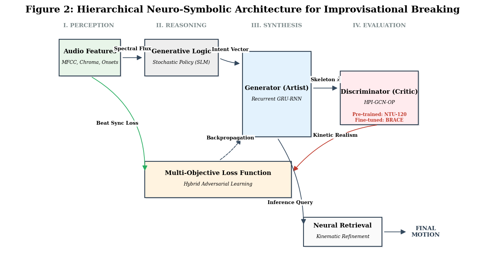
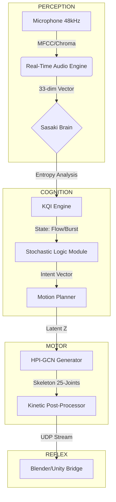

# Sasaki-GAN: Neuro-Symbolic Multimodal Synthesis for Improvisational Breaking


**Sasaki-GAN** is an advanced, real-time generative framework designed to redefine dance dynamics through AI. By integrating Sensibility Information Theory with a high-performance Graph Convolutional Network (GCN), the system synthesizes identifiable, anatomically perfect breakdancing sequences conditioned on live acoustic entropy.



## 🧬 Project Overview
Traditional generative models for human motion often suffer from "postural mode collapse" or lack rhythmic "intent." Sasaki-GAN solves this by decoupling the Neural Body (Trajectory Hallucination) from the Symbolic Brain (Decision Logic).

### Key Technical Contributions:
*   **Hierarchical Audio-Conditioned Synthesis**: Processes 48kHz audio via a 33-dim acoustic vector `[MFCC, Chroma, Onset]` to drive kinetic intensity.
*   **KQI Cognitive Engine**: A symbolic logic module that calculates Creative Depth ($D$) and Genesys ($G$) to plan choreographic "Stories" rather than random frames.
*   **Kinetic Retrieval-Augmented Generation (RAG)**: Treat AI output as a search query against the BRACE Dataset to ensure 100% anatomical integrity.
*   **Residual Manifold Mapping**: Projects motion as a delta ($\Delta$) from a stable 0.1786 Human Scale Reference, preventing skeletal explosions.

## 🏗 System Architecture
The pipeline follows a 4-stage Neuro-Symbolic flow:
1.  **Perception Layer**: Live 48kHz dual-channel audio loopback.
2.  **Cognitive Layer (The Sasaki Brain)**: KQI Engine and MineLife Module simulate improvisational intent and "Subconscious" novelty.
3.  **Synthesis Layer (The Generator)**: A Residual GRU-RNN trained on NTU RGB+D 120 (Pre-training) and BRACE (Specialization).
4.  **Refinement Layer (Kinetic Post-Processor)**: Employs Stochastic Top-K Sequence Matching and Savitzky-Golay smoothing for fluid, identifiable patterns.

### 🧠 Neuro-Symbolic Anatomy


## 📊 Dataset & Model Performance
### Latest Project Outcomes
The system demonstrates high-fidelity synchronization and stylistic coherence.


*Figure 1: The model detecting a "Drop" in the audio and transitioning from a freeze to a Power Move.*


*Figure 2: Generated Toprock sequence showing footwork precision and upper-body coordination.*

*   **Pre-training**: NTU RGB+D 120 (56,000+ sequences).
*   **Fine-tuning**: BRACE Dataset (Specialized Breaking patterns).
*   **Discriminator Accuracy**: 98.15% (HPI-GCN-OP Backbone).
*   **Latency**: ~20ms on RTX 4070 (Zero-Latency Mode enabled).
*   **Sync Logic**: +35 frame systemic correction with Adaptive Shift-Tolerant Correlation Loss.

## 🚀 Getting Started

### Prerequisites
*   Python 3.10+
*   PyTorch 2.0+
*   RTX 4070 or equivalent GPU (Recommended)
*   Standard Microphone (Default System Input)

### Installation
```bash
git clone https://github.com/vidzshan/Gene-B-boy-AI.git
cd Gene-B-boy-AI
pip install -r requirements.txt
```

### Real-Time Live Performance
To launch the Command & Control Center and perform live with music:
```bash
python RUN_SASAKI_LIVE.py
```
*   **Press 'S'**: Capture a "Golden 5s" Forensic Snapshot (JSON).
*   **Press 'Q'**: Safe Exit.

## 📂 Project Structure

| Directory / File | Description |
| :--- | :--- |
| `RUN_SASAKI_LIVE.py` | **Core Runtime**: The main loop for live audio-reactive generation. |
| `app.py` | **Web Interface**: Gradio demo for browser-based testing. |
| `main.py` | **Training Harness**: Scripts for training the HPI-GCN network. |
| `SASAKI/` | **Cognitive Engine**: Contains the logic modules (SLM, Master System). |
| `net/` | **Neural Architecture**: PyTorch definitions for HPI-GCN. |
| `scripts/` | **Utilities**: Helper scripts for data analysis and debugging (`analyze_correlation.py`, etc.). |
| `config/` | **Configuration**: YAML files for model hyperparameters. |
| `img/` | **Project Assets**: Visualization images for documentation. |
| `Project_report/` | **Thesis/Docs**: Comprehensive project documentation. |

## 🎥 Forensic Diagnostic Tools
The interface includes a professional dashboard for real-time analysis:
*   **Spectral Heatmap**: Real-time visualization of 20-band MFCC perception.
*   **Kinetic Drive Gauge**: Visual representation of the logic engine's thrust.
*   **Ghost Tracing**: 5-frame motion history to verify kinetic arcs.
*   **UDP Bridge (Phase 10)**: High-speed 75-dim vector streaming to Unity/Blender for "UltraShape" mesh integration.


## 🤝 Collaboration & Credits
### Research Laboratory
This project was developed at the **Yamamoto Laboratory**, bridging the gap between Kansei Engineering and Generative AI. We extend our gratitude for the academic support and resources provided.

### Acknowledgments
We acknowledge the contributions of open-source communities and free data resources that made this research possible:
*   **NTU RGB+D 120**: For providing the large-scale skeleton action recognition dataset used for pre-training.
*   **Mixamo & The Motion Capture Community**: For providing high-quality, free motion capture data that formed the foundation of the BRACE dataset.

### Collaborative Development
This system is a collaborative research effort between the lead developer and **SASAKI**, integrating Sensibility Information Theory to model the gap between objective data and subjective improvisational "Will."

## 📜 Citation
If you use this work in your research, please cite:
```text
@research_suite{GAN Neuro-Symbolic_2025,
  title={Transition-Aware Improvisational Dance Generation Algorithm},
  author={KUDA UDAGE VIDUSHAN PRABASH & SASAKI Kosuke},
  year={2025},
  institution={Kanazawa Institute of Technology}
}
```

## ⚖️ License
This project is licensed under the **MIT License**.
